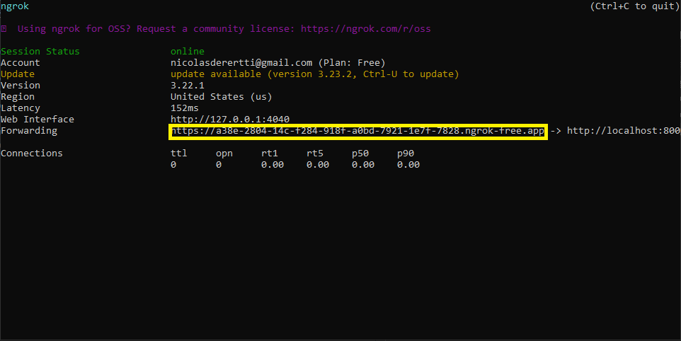

# Como usar o PyNgrok

## Índices
- [Introdução](https://github.com/nKikito/Como_usar_o_PyNgrok?tab=readme-ov-file#introdu%C3%A7%C3%A3o)
- [Baixando o pyngrok](https://github.com/nKikito/Como_usar_o_PyNgrok?tab=readme-ov-file#baixando-o-pyngrok)
- [Copiando o token](https://github.com/nKikito/Como_usar_o_PyNgrok?tab=readme-ov-file#copiando-o-token)
- [Método 1: Usar o CMD (Prompt de comando)](https://github.com/nKikito/Como_usar_o_PyNgrok?tab=readme-ov-file#m%C3%A9todo-1-usar-o-cmd-prompt-de-comando)
- [Método 2: Usar um arquivo python](https://github.com/nKikito/Como_usar_o_PyNgrok?tab=readme-ov-file#m%C3%A9todo-2-usar-um-arquivo-python)
- [Observações](https://github.com/nKikito/Como_usar_o_PyNgrok?tab=readme-ov-file#observações)
    1. [Django](https://github.com/nKikito/Como_usar_o_PyNgrok?tab=readme-ov-file#django)
    2. [XAMPP](https://github.com/nKikito/Como_usar_o_PyNgrok?tab=readme-ov-file#xampp)
    3. [Ver requisições](https://github.com/nKikito/Como_usar_o_PyNgrok?tab=readme-ov-file#ver-requisi%C3%A7%C3%B5es)


## Introdução
Este repositório mostra como colocar a sua aplicação no 'ar' com o pyngrok. O pyngrok é uma biblioteca python que facilita o uso da ferramenta ngrok, já que com a biblioteca não é necessário baixar o ngrok, só ter o seu _auth token_. O ngrok é uma ferramenta "transforma" o seu computador em um servidor e te dá um link temporário onde você e outras pessoas conseguem usar a sua aplicação através de algum navegador.

## Baixando o pyngrok
Primeiro, você deve ter o python instalado em sua máquina para baixar a biblioteca (se você não tem o python baixado clique [aqui](https://www.python.org/)). Agora, vamos criar um ambiente virtual para garantir que nenhum conflito aconteça, para isso abra o CMD (Prompt de comando) e insira o comando: `python -m venv nome_do_seu_ambiente_virtual`. Depois disso vamos ativar o ambiente virtual, se você estiver no Windows insira o comando: `cd nome nome_do_seu_ambiente_virtual\Scripts` e depois: `activate` . Se você não estiver no Windows insira o comando: `source nome_do_seu_ambiente_virtual/bin` e depois: `activate` . Agora que já iniciamos o ambiente podemos baixar a biblioteca usando o comando: `pip install pyngrok` .

## Copiando o token
Entre nesse site da [ngrok](https://dashboard.ngrok.com/get-started/your-authtoken) se cadastre e clique em _copy_ para copiar seu Authtoken.

## Método 1: Usar o CMD (Prompt de comando)
Abra o seu CMD e ative o seu ambiente virtual, da mesma forma que você ativou quando estava baixando o pyngrok, e insira o comando: `ngrok config add-authtoken seu_token` (o seu_token é o token que você copiou após ter se logado no site da ngrok). Depois que já estiver concluído é só colocar ngrok + protocolo de comunicação + porta onde a aplicação está rodando. Ex: `ngrok http 80`. Depois disso copie o link que está depois de forwarding. O local onde vai aparecer o link está em amarelo. 
É só colocar esse link em um navegador e você poderá utilizar a sua aplicação.

## Método 2: Usar um arquivo python
Crie um arquivo .py e insira o código:
```python
from pyngrok import ngrok
import time

# Estabiliza a conexão
ngrok.set_auth_token(seu_auth_token)
url = ngrok.connect(porta, protocolo_comunicacao)

# Mostra url no terminal
print(f"Link da sua aplicação {url.public_url}")

# Mantém a url funcionando
try:
    while True:
        time.sleep(1)
except KeyboardInterrupt:
    print("Fechando a comunicação")
```
seu_auth_token é o token que você copiou do site da ngrok, a porta é a porta onde a sua aplicação está rodando Ex: 8000, protocolo_comunicacao é o protocolo de comunicação onde a sua aplicação está rodando Ex: http. Se você estiver utilizando o VsCode terá que selecionar o ambiente virtual que está utilizando para conseguir rodar o código, para isso use o atalho `Ctrl+Shift+P` e pesquise por **Python: Create Environment** e selecione essa opção, depois clique em **Venv** e **Enter interpreter path...** , após isso clique em **Find** e procure pelo seu ambiente virtual, após encotrá-lo vá para **Scripts** e selecione o arquivo, que está dentro de Scripts, que se chama **python** , então é só rodar o código, se não tiver como rodar o código você pode utilizar o atalho `Ctrl+Shift+'` para abrir um terminal, depois é só escrever: `python .\nome_arquivo.py` (troque o nome_arquivo pelo nome que você colocou no seu arquivo .py). Você também pode utilizar o CMD para rodar o código, pelo CMD vá até a pasta onde está o arquivo .py e execute o comando: `python .\nome_arquivo.py` (troque o nome_arquivo pelo nome que você colocou no seu arquivo .py). Depois de copiar a url você pode colocar em algum navegador e utilizar a sua aplicação.

## Observações
- ### Django
    Você deve rodar o `python manage.py` runserver para que o link da ngrok funcione.
    Coloque o seguinte código no seu arquivo **settings.py** para que 
os formulários que tenham o método POST não sejam proibidos 
```python
ALLOWED_HOSTS.append("*") 
CSRF_TRUSTED_ORIGINS = [ 
url gerada pelo ngrok 
]
```

- ### XAMPP
    Quando você inserir a url no navegador irá aparecer /dashboard/, 
    no lugar de dashboard coloque o nome da pasta/arquivo que você deseja utilizar. 

- ### Ver requisições
    Quando a sua aplicação já estiver rodando pelo ngrok, você consegue ver as requisições através do [localhost:4040/inspect/http](http://localhost:4040/inspect/http).
